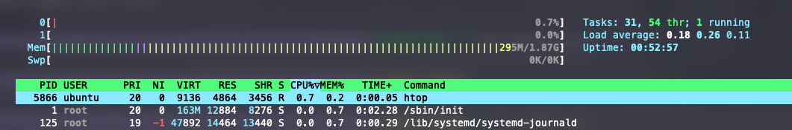

# Docker Resource Management

## Overview

Docker containers share the host system's kernel and resources. Without explicit constraints, a single container can consume all available CPU, memory, or disk I/O, which is fine for development but dangerous in production.

Docker uses Linux cgroups (control groups) to isolate and limit container resources. Understanding how these mechanisms work is essential knowledge that translates directly to Kubernetes, where the same underlying cgroup controls power pod resource management.

This lab is split into two parts:

- **Part 1** covers cgroups fundamentals, CPU constraints, and process limits
- **Part 2** covers memory constraints, monitoring, troubleshooting, and real-world scenarios

By the end of this lab, you will understand:

- How cgroups provide the foundation for container resource isolation
- The difference between CPU shares, hard limits, and CPU pinning
- How to prevent fork bombs with process limits
- How to monitor CPU throttling and identify misconfigured limits
- How memory limits, reservations, and swap interact
- How to troubleshoot OOM kills and memory issues
- How to update resource limits on running containers without downtime

---

# Part 1: Cgroups Foundation and CPU Constraints

## Step 1: Explore the Cgroups Foundation

Control groups (cgroups) are a Linux kernel feature that has been available since 2008. They provide the mechanism that Docker (and all container runtimes) use to isolate and limit container resources. Before working with Docker resource flags, it helps to understand what's happening under the hood.

There are two versions of cgroups:

- **Cgroups v1**: Uses separate hierarchies for each resource type, with each controller mounted at its own path (e.g., `/sys/fs/cgroup/cpu`, `/sys/fs/cgroup/memory`). Found on older Linux distributions.
- **Cgroups v2**: Uses a unified hierarchy with a single mount point at `/sys/fs/cgroup`. This is the modern approach and is now the default on most distributions.

Determine which version your system is using:

```console
mount | grep cgroup
```

On modern Ubuntu systems (22.04+), you should see a **cgroups v2** unified hierarchy mounted at `/sys/fs/cgroup`. If you see multiple mounts under `/sys/fs/cgroup/cpu`, `/sys/fs/cgroup/memory`, etc., you're on cgroups v1.

Verify by checking which cgroup filesystems the kernel supports:

```console
cat /proc/filesystems | grep cgroup
```

If you see `cgroup2`, your system supports the unified hierarchy.

Now check which cgroup driver Docker is using:

```console
docker info | grep -i cgroup
```

You should see the **Cgroup Driver** (either `systemd` or `cgroupfs`) and the **Cgroup Version**. Modern systems use `systemd` as the cgroup manager. This distinction matters for Kubernetes because `systemd` is now the recommended driver, as it avoids conflicts when both Docker and systemd try to manage cgroups simultaneously.

## Step 2: See How Docker Creates Cgroups

Every time you start a container with resource constraints, Docker creates a cgroup hierarchy for that container. This hierarchy contains special files that the kernel reads to enforce limits. Understanding this structure is valuable for troubleshooting because when `docker stats` doesn't give you enough detail, you can inspect these files directly.

Start a container with both memory and CPU limits:

```console
docker run -d --name cgroup-demo --memory 256m --cpus="0.5" nginx
```

Find the container's full ID (Docker uses this to name the cgroup directory):

```console
CONTAINER_ID=$(docker inspect --format='{{.Id}}' cgroup-demo)
echo $CONTAINER_ID
```

Now explore the cgroup hierarchy Docker created. On cgroups v2 with the systemd driver, Docker creates a scope unit under `system.slice`:

```console
ls /sys/fs/cgroup/system.slice/docker-${CONTAINER_ID}.scope/
```

You should see many files, each representing a kernel control interface. The important ones for resource management include:

- `cpu.max`: CPU quota and period (hard CPU limit)
- `cpu.stat`: CPU usage and throttling statistics
- `memory.max`: Hard memory limit
- `memory.current`: Current memory usage
- `memory.stat`: Detailed memory usage breakdown
- `pids.current`: Number of running processes

Verify the memory limit is set correctly. The value should be 268435456 bytes, which is 256MB:

```console
cat /sys/fs/cgroup/system.slice/docker-${CONTAINER_ID}.scope/memory.max
```

Verify the CPU limit. On cgroups v2, `cpu.max` shows two numbers: the quota and the period (both in microseconds):

```console
cat /sys/fs/cgroup/system.slice/docker-${CONTAINER_ID}.scope/cpu.max
```

You should see `50000 100000`, meaning the container can use 50,000 microseconds out of every 100,000 microsecond period. That's 50% of one CPU core, matching the `--cpus="0.5"` flag.

Clean up:

```console
docker rm -f cgroup-demo
```

## Step 3: Observe Unconstrained CPU Usage

To understand why CPU constraints matter, first observe what happens when a container runs without any limits. By default, Docker places no CPU restrictions on containers, so a single container can consume all available CPU on the host.

Start a container that generates heavy CPU load with two stress workers:

```console
docker run -d --name stresser polinux/stress stress -c 2
```

Use `docker stats` to see the container consuming CPU:

```console
docker stats --no-stream --format "table {{.Name}}\t{{.CPUPerc}}\t{{.MemUsage}}"
```

You can also use `htop` in a separate terminal to observe the impact on the host system. You should see the stress processes consuming significant CPU across your available cores.


This is the "noisy neighbor" problem: without limits, one container can starve other workloads on the same host.

Stop and remove the container:

```console
docker stop stresser && docker rm stresser
```

Verify with `htop` or `docker stats` that CPU usage has returned to normal.



## Step 4: CPU Pinning with cpuset

CPU pinning restricts a container to specific CPU cores using the `--cpuset-cpus` flag. This can improve performance for workloads that benefit from cache locality, because the container's data stays in that core's L1/L2 cache. It's also important for NUMA architectures where memory access times vary based on which CPU is accessing which memory bank.

However, pinning reduces flexibility and can lead to poor utilization if those cores are busy while others sit idle. Only use pinning for high-performance computing, real-time systems, or when you've measured a specific benefit.

Run the stress container pinned to only the first CPU core (core 0):

```console
docker run -d --name stresser --cpuset-cpus 0 polinux/stress stress -c 2
```

Use `htop` to verify that the container's processes are constrained to the specified CPU core. You should see only core 0 at high utilization while other cores remain idle.


Stop and remove the container:

```console
docker stop stresser && docker rm stresser
```

## Step 5: CPU Shares (Relative Priority During Contention)

CPU shares are often misunderstood. They are **not** hard limits. Instead, they define **relative priority** between containers, and only come into play when containers are competing for CPU time. If no contention exists, a container can use all available CPU regardless of its share value.

Think of it like splitting a pizza: shares determine how you divide slices when everyone is hungry, but if someone isn't hungry, others can eat their portion. The default share value is 1024.

Start two containers with different share values, both pinned to CPU core 0 so they compete directly:

```console
docker run -d --name container-1 --cpuset-cpus 0 --cpu-shares 768 \
  polinux/stress stress -c 2

docker run -d --name container-2 --cpuset-cpus 0 --cpu-shares 256 \
  polinux/stress stress -c 2
```

`container-1` has 3x the shares of `container-2` (768 / 256 = 3), so during contention on core 0, it should receive roughly 3x the CPU time.

Watch the CPU distribution with `docker stats`:

```console
docker stats --no-stream --format "table {{.Name}}\t{{.CPUPerc}}\t{{.MemUsage}}"
```

Run this command several times. You should see `container-1` consistently getting about 75% of CPU time and `container-2` about 25%.

You can also observe this distribution in `htop`:


Now stop `container-2` and observe what happens:

```console
docker stop container-2
docker stats --no-stream --format "table {{.Name}}\t{{.CPUPerc}}"
```

With no contention, `container-1` consumes all available CPU on core 0. This demonstrates that shares are about priority, not limits. They're an efficient way to allocate CPU without wasting idle capacity.

Clean up:

```console
docker rm -f container-1 container-2
```

## Step 6: CPU Hard Limits (Guaranteed Boundaries)

Unlike shares, hard limits cap CPU usage **regardless of available capacity**. Even if the host has idle CPUs, a container with a hard limit cannot exceed its allocation. This is important when you need predictable resource consumption for cost allocation, co-locating sensitive workloads, or matching Kubernetes resource limits.

Docker provides two ways to set hard limits.

**Method 1: Using `--cpus` (recommended)**

The `--cpus` flag is the simplest and most intuitive way to set a CPU hard limit. The value represents the number of CPU cores the container can use:

```console
docker run -d --name cpu-limited --cpus="1.0" \
  polinux/stress stress --cpu 4
```

This container launches 4 stress workers, each trying to consume a full CPU core. But the hard limit restricts total usage to 1.0 CPU core worth of time. Observe:

```console
docker stats --no-stream --format "table {{.Name}}\t{{.CPUPerc}}"
```

The CPU percentage should hover around **100%** (representing 100% of 1 CPU), not 400%. The kernel enforces this by throttling the container when it exceeds its quota in each scheduling period.

**Method 2: Using `--cpu-quota` and `--cpu-period`**

Under the hood, `--cpus` is shorthand for setting quota and period values directly. The default period is 100,000 microseconds (100ms), and the quota specifies how many microseconds the container can use per period.

The relationship is: **cpus = cpu-quota / cpu-period**

For example:
- `--cpus="1.5"` is equivalent to `--cpu-quota=150000 --cpu-period=100000`
- `--cpus="0.75"` is equivalent to `--cpu-quota=75000 --cpu-period=100000`

Start a container using the explicit quota/period syntax to see this in action:

```console
docker run -d --name cpu-quota-demo --cpu-quota=75000 --cpu-period=100000 \
  polinux/stress stress --cpu 4
```

This allows 75,000 microseconds of CPU time per 100,000 microsecond period, which is 75% of one CPU core:

```console
docker stats --no-stream --format "table {{.Name}}\t{{.CPUPerc}}"
```

CPU usage should be capped at roughly **75%**. For most use cases, the `--cpus` flag is preferred because it's more intuitive and maps directly to Kubernetes resource limits.

Clean up:

```console
docker rm -f cpu-limited cpu-quota-demo
```

## Step 7: Detect CPU Throttling

When a container hits its CPU hard limit, the kernel doesn't crash it. Instead, it **throttles** the container, forcing it to wait until the next scheduling period before it can use more CPU time. This causes latency spikes that can be difficult to diagnose because the container appears healthy but responds slowly.

Throttling is the key metric to watch when tuning CPU limits. High throttle counts mean your limits are too restrictive for the workload.

Start a CPU-limited container under heavy load:

```console
docker run -d --name throttle-demo --cpus="0.5" \
  polinux/stress stress --cpu 4
```

Get the container's full ID to locate its cgroup directory:

```console
CONTAINER_ID=$(docker inspect --format='{{.Id}}' throttle-demo)
```

Check the CPU throttling statistics in the cgroup:

```console
cat /sys/fs/cgroup/system.slice/docker-${CONTAINER_ID}.scope/cpu.stat
```

Look for these key fields in the output:

| Metric | Meaning |
|--------|---------|
| **nr_periods** | Total number of CPU scheduling periods that have elapsed |
| **nr_throttled** | Number of periods where the container was throttled (forced to wait) |
| **throttled_usec** | Total time the container spent waiting due to throttling (in microseconds) |

A high **nr_throttled / nr_periods** ratio (close to 1.0) means the container is being throttled almost every period. This is a strong signal that the CPU limit is too restrictive or the workload needs optimization.

Wait a few seconds and check again to see the values climbing:

```console
sleep 5
cat /sys/fs/cgroup/system.slice/docker-${CONTAINER_ID}.scope/cpu.stat
```

In production, if you see high throttle counts combined with application slowness, the fix is usually to increase the CPU limit. Don't just look at `docker stats`. A container showing 100% CPU usage near its limit while also being heavily throttled is being starved.

Clean up:

```console
docker rm -f throttle-demo
```

## Step 8: Preventing Fork Bombs with PID Limits

A fork bomb is a process that endlessly replicates itself, consuming all available process IDs on the host and potentially bringing the entire system down. Docker's `--pids-limit` flag uses the cgroup PID controller to cap the number of processes a container can create.

Run a container with a PID limit of 200:

```console
docker run --rm -it --pids-limit 200 debian:bookworm bash
```

Inside the container, attempt to create a fork bomb:

```console
:(){ :|: & };:
```

Observe how the process limit prevents the container from consuming all resources. Without this limit, this command would crash the entire host by exhausting all available PIDs. The cgroup PID controller contains the damage to just this container.

Exit the container with `Ctrl-C`.

This is an important defense-in-depth measure for production systems. Even if your applications don't intentionally fork excessively, bugs or exploits could trigger runaway process creation.

---

## Part 1 Summary

In Part 1, you explored the cgroups foundation and CPU resource controls:

| Concept | Key Takeaway |
|---------|-------------|
| **Cgroups** | Docker uses Linux cgroups to enforce resource limits. You can inspect cgroup files directly for troubleshooting. |
| **Unconstrained Containers** | Without limits, a single container can consume all host CPU, causing the "noisy neighbor" problem. |
| **CPU Pinning** | `--cpuset-cpus` restricts containers to specific cores. Useful for cache locality but reduces scheduling flexibility. |
| **CPU Shares** | Relative priority that only applies during contention. Containers can burst when there's no competition. |
| **CPU Hard Limits** | `--cpus` enforces strict boundaries regardless of available capacity. Use for production workloads. |
| **CPU Throttling** | Check `cpu.stat` for `nr_throttled`. High values indicate limits are too restrictive. |
| **PID Limits** | `--pids-limit` prevents fork bombs and runaway process creation from taking down the host. |

---

# Part 2: Memory Constraints, Monitoring, and Real-World Scenarios

## Step 9: Monitor Memory Consumption

Containers consume memory as they run, and monitoring usage is critical for capacity planning and troubleshooting. The `docker stats` command provides real-time resource usage metrics for running containers.

Start a container that allocates and holds 256MB of memory:

```console
docker run -d --name memory-hog polinux/stress stress --vm 1 --vm-bytes 256M --vm-hang 0
```

The `stress` tool's `--vm` flag creates a worker that continuously allocates and frees memory. With `--vm-bytes 256M`, it works with 256MB chunks, and `--vm-hang 0` tells it to re-allocate immediately after freeing.

Monitor the memory usage:

```console
docker stats --no-stream --format "table {{.Name}}\t{{.CPUPerc}}\t{{.MemUsage}}\t{{.MemPerc}}"
```

Run this a few times and note the memory usage. Without any limits set, the container can consume as much host memory as it wants. This is the baseline behavior you need to constrain in production.

Stop and remove the container:

```console
docker stop memory-hog && docker rm memory-hog
```

## Step 10: Memory Limits and OOM Behavior

Memory is fundamentally different from CPU. CPU is a **compressible** resource: when a container exceeds its CPU limit, it gets throttled (slowed down). Memory is **non-compressible**, meaning you either have it or you don't. When a container tries to use more memory than its limit allows, the kernel's OOM (Out of Memory) killer terminates the container's main process, usually causing the container to exit.

This means memory issues cause **sudden death** rather than gradual degradation, making them harder to troubleshoot. Without any memory limits, a memory leak in one container can consume all host memory, triggering the host-level OOM killer which might terminate critical system processes or other containers.

Start a container with a 100MB memory limit and deliberately try to allocate 150MB:

```console
docker run -d --name oom-demo -m 100m \
  polinux/stress stress --vm 1 --vm-bytes 150M --vm-hang 60
```

The `--vm-bytes 150M` tells the stress worker to allocate 150MB, well beyond the container's 100MB limit.

Wait a few seconds for the OOM event, then check the container's status:

```console
docker ps -a --filter name=oom-demo --format "table {{.Names}}\t{{.Status}}"
```

The container should have exited. Verify it was killed by the OOM killer:

```console
docker inspect --format='{{.State.OOMKilled}}' oom-demo
```

This should return `true`. You can also check the kernel log for details about the OOM event:

```console
sudo dmesg | grep -i "oom\|killed process" | tail -5
```

You should see kernel messages showing which process was killed, the memory state at the time, and which cgroup constraint triggered the kill. This is your primary troubleshooting tool when containers die unexpectedly. If you see OOM events in `dmesg`, either increase the memory limit or fix the memory leak.

Clean up:

```console
docker rm -f oom-demo
```

## Step 11: Memory Reservation (Soft Limits)

While hard memory limits (`-m`) enforce a strict ceiling, memory reservations set a **soft limit**, a target that Docker tries to maintain when the host is under memory pressure. The container can exceed its reservation up to the hard limit during normal operation.

Think of reservations as a guarantee: "this container should have at least this much memory available." When the host is running low on memory, Docker will try to reclaim memory from containers back down to their reservation levels.

Start a container with both a hard limit and a soft reservation:

```console
docker run -d --name reservation-demo -m 512m --memory-reservation 256m \
  nginx
```

Inspect both values to confirm they were set:

```console
docker inspect --format='Hard limit: {{.HostConfig.Memory}} bytes | Reservation: {{.HostConfig.MemoryReservation}} bytes' reservation-demo
```

This container can use up to 512MB (hard limit), but Docker will try to reclaim memory down to 256MB when the host is under pressure. This is useful for workloads with variable memory patterns, like web servers that cache data. They can burst when needed but give back memory when the system needs it.

**Best practice**: Set the reservation to about 70-80% of the hard limit to leave room for bursting while still providing a useful scheduling hint.

Clean up:

```console
docker rm -f reservation-demo
```

## Step 12: Controlling Swap Behavior

Swap space allows the system to move less-used memory pages to disk when RAM is full. This can prevent OOM kills but causes severe performance degradation because disk I/O is orders of magnitude slower than memory access.

By default, when you set a memory limit with `-m`, Docker sets `--memory-swap` to twice the memory limit. This means a container with `-m 256m` can actually use up to 512MB total: 256MB of RAM plus 256MB of swap. This behavior can be surprising and cause hard-to-diagnose performance issues.

**Disable swap entirely** by setting `--memory-swap` equal to `--memory`:

```console
docker run -d --name no-swap -m 100m --memory-swap 100m \
  nginx
```

Verify the configuration:

```console
docker inspect --format='Memory: {{.HostConfig.Memory}} | Swap: {{.HostConfig.MemorySwap}}' no-swap
```

When both values are equal, the container has **zero swap** available. This gives predictable performance: the container runs within its memory limit or gets OOM killed. There's no middle ground where it silently degrades.

Compare this to allowing swap:

```console
docker run -d --name with-swap -m 100m --memory-swap 200m \
  nginx
```

```console
docker inspect --format='Memory: {{.HostConfig.Memory}} | Swap: {{.HostConfig.MemorySwap}}' with-swap
```

This container can use 100MB RAM + 100MB swap. Important: the `--memory-swap` value represents the **total** of memory plus swap combined, not the swap amount alone. So `--memory-swap 200m` with `-m 100m` gives 100MB of swap.

For production workloads where predictable performance matters, disabling swap is generally recommended.

Clean up:

```console
docker rm -f no-swap with-swap
```

## Step 13: Inspect Memory Usage Breakdown

When debugging memory issues, `docker stats` gives you a single number, but that number includes both your application's actual memory usage and kernel page cache. Understanding the breakdown helps you determine whether a container genuinely needs more memory or if the high usage is just harmless file system caching.

Start a container and generate some file I/O to populate the page cache:

```console
docker run -d --name mem-breakdown -m 256m nginx
```

Write a 50MB file inside the container to generate cached file data:

```console
docker exec mem-breakdown sh -c "dd if=/dev/zero of=/tmp/testfile bs=1M count=50 2>/dev/null"
```

Now inspect the detailed memory breakdown by reading the cgroup's `memory.stat` file:

```console
CONTAINER_ID=$(docker inspect --format='{{.Id}}' mem-breakdown)
cat /sys/fs/cgroup/system.slice/docker-${CONTAINER_ID}.scope/memory.stat
```

The output contains many fields. The most important ones for troubleshooting are:

| Metric | Description |
|--------|-------------|
| **anon** | Anonymous memory (heap, stack, and other allocations made by your application). This is the memory your app is actually using. |
| **file** | Page cache (cached file system data). The kernel uses unused memory to cache files for faster access. This memory can be reclaimed under pressure. |
| **shmem** | Shared memory between processes |
| **pgfault** | Number of page faults (memory access that required loading from disk) |

After writing the 50MB file, you should see a high `file` value (around 50MB). This page cache is being counted against the container's memory limit even though it can be reclaimed if needed. This is a common reason containers appear to use more memory than expected.

Compare the cgroup breakdown to what `docker stats` reports:

```console
docker stats --no-stream --format "table {{.Name}}\t{{.MemUsage}}\t{{.MemPerc}}" mem-breakdown
```

Clean up:

```console
docker rm -f mem-breakdown
```

## Step 14: Update Resources on a Running Container

Docker allows you to modify resource limits on running containers without restarting them using `docker update`. This is particularly useful for production troubleshooting because you can relieve resource pressure without disrupting the service. (Note: this flexibility doesn't exist as easily in Kubernetes, where you typically need to redeploy pods.)

Start a container with a restrictive CPU limit:

```console
docker run -d --name update-demo --cpus="0.25" \
  polinux/stress stress --cpu 2
```

Observe the constrained CPU usage (should be around 25%):

```console
docker stats --no-stream --format "table {{.Name}}\t{{.CPUPerc}}"
```

Now double the CPU allocation without restarting the container:

```console
docker update --cpus="0.5" update-demo
```

Check the effect immediately:

```console
docker stats --no-stream --format "table {{.Name}}\t{{.CPUPerc}}"
```

CPU usage should have roughly doubled to ~50%. The change takes effect immediately because Docker simply updates the cgroup files, and the kernel picks up the new limits on the next scheduling period.

You can also update memory limits on a running container:

```console
docker update --memory 512m --memory-swap 512m update-demo
```

Verify the change took effect:

```console
docker inspect --format='{{.HostConfig.Memory}}' update-demo
```

The output (in bytes) should show 536870912, reflecting the new 512MB limit.

Clean up:

```console
docker rm -f update-demo
```

## Step 15: Real-World Scenario: Java Application Memory

Java applications are notorious for unexpected OOM kills in containers because the JVM uses significant memory beyond the heap. When developers set the JVM heap (`-Xmx`) equal to the container memory limit, they leave no room for:

- **Metaspace**: storage for class metadata
- **Thread stacks**: each thread allocates stack memory (typically 512KB-1MB per thread)
- **JIT compilation**: the Just-In-Time compiler uses memory for compiled code
- **Native libraries**: JNI code, I/O buffers, and other native allocations
- **GC overhead**: garbage collector data structures

This step demonstrates why you always need headroom between the heap and the container limit.

Run a Java container with a 200MB container limit and a heap that's too large at 180MB. The JVM will attempt to allocate heap plus all the non-heap memory, likely exceeding the container limit:

```console
docker run --name java-bad -m 200m eclipse-temurin:17-jdk \
  java -Xmx180m -Xms180m -XX:+UseSerialGC \
  -cp /dev/null -version 2>&1 ; echo "exit: $?"
```

Check if it was OOM killed:

```console
docker inspect --format='OOMKilled: {{.State.OOMKilled}} | ExitCode: {{.State.ExitCode}}' java-bad
```

Even if this particular test completes (because `-version` exits quickly), in a real application that keeps running, the JVM's non-heap memory usage accumulates over time. Thread stacks grow as requests come in, the JIT compiler caches more code, and class loading continues. Eventually, the combined heap + non-heap usage exceeds the container limit and the OOM killer strikes.

The safe approach is to set the heap to about **75%** of the container limit, leaving room for everything else:

```console
docker run -d --name java-good -m 256m eclipse-temurin:17-jdk \
  sh -c "java -Xmx192m -Xms64m -XX:+UseSerialGC -XX:MaxMetaspaceSize=48m -version && sleep 300"
```

Check its memory usage:

```console
docker stats --no-stream --format "table {{.Name}}\t{{.MemUsage}}\t{{.MemPerc}}" java-good
```

**Rule of thumb for Java containers:**

| Container Memory | Recommended Max Heap (`-Xmx`) |
|-----------------|-------------------------------|
| 256 MB | 192 MB |
| 512 MB | 384 MB |
| 1 GB | 768 MB |
| 2 GB | 1536 MB |

You can also enable native memory tracking to see exactly where JVM memory goes: add `-XX:NativeMemoryTracking=summary` to your JVM flags and use `jcmd <pid> VM.native_memory summary` inside the container.

Clean up:

```console
docker rm -f java-bad java-good
```

## Step 16: Real-World Scenario: Multi-Threaded CPU Limits

When a multi-threaded application runs with a CPU limit lower than its thread count, the threads must share the limited CPU time. The kernel constantly context-switches between threads, each one getting a tiny slice before being paused. This context switching itself consumes CPU cycles, creating overhead that reduces useful work.

In production, this manifests as increased request latency and reduced throughput because the application is spending more time switching between threads than doing actual work.

Run a stress container simulating 8 threads but limited to 0.5 CPU:

```console
docker run -d --name threads-constrained --cpus="0.5" \
  polinux/stress stress --cpu 8
```

Run another with the same 8 threads but with a more generous limit:

```console
docker run -d --name threads-relaxed --cpus="1.5" \
  polinux/stress stress --cpu 8
```

Compare their CPU usage:

```console
docker stats --no-stream --format "table {{.Name}}\t{{.CPUPerc}}"
```

Now check throttling for each container to see the difference in how aggressively the kernel is limiting them:

```console
CONSTRAINED_ID=$(docker inspect --format='{{.Id}}' threads-constrained)
RELAXED_ID=$(docker inspect --format='{{.Id}}' threads-relaxed)

echo "=== Constrained (0.5 CPU, 8 threads) ==="
cat /sys/fs/cgroup/system.slice/docker-${CONSTRAINED_ID}.scope/cpu.stat

echo ""
echo "=== Relaxed (1.5 CPUs, 8 threads) ==="
cat /sys/fs/cgroup/system.slice/docker-${RELAXED_ID}.scope/cpu.stat
```

The constrained container should show significantly higher throttling (higher `nr_throttled` relative to `nr_periods`). Each of its 8 threads is fighting for a sliver of 0.5 CPU, resulting in constant context switches and throttling.

**Best practice**: Match your CPU limit to your application's expected parallelism. If your application spawns 4 worker threads, give it at least 2-4 CPUs. If your Java application has a thread pool of size 8, setting `--cpus="1"` will cause those threads to constantly context-switch, creating massive overhead. Profile your application to understand its concurrency needs before setting CPU limits.

Clean up:

```console
docker rm -f threads-constrained threads-relaxed
```

## Step 17: Comprehensive Monitoring with docker stats

The `docker stats` command is your first-line monitoring tool for container resource usage. By default it shows all metrics in a live-updating display, but you can customize the output format to focus on specific metrics. This is especially useful when building monitoring scripts or quickly diagnosing issues.

Start several containers with different resource configurations to simulate a realistic environment:

```console
docker run -d --name web -m 128m --cpus="0.5" nginx
docker run -d --name cache -m 256m --cpus="1.0" redis
docker run -d --name worker --cpus="1.5" -m 512m \
  polinux/stress stress --cpu 2 --vm 1 --vm-bytes 100M
```

The `--no-stream` flag shows a single snapshot instead of continuous updates. Combined with `--format`, you can build focused monitoring views.

View a comprehensive resource summary with all key metrics:

```console
docker stats --no-stream --format "table {{.Name}}\t{{.CPUPerc}}\t{{.MemUsage}}\t{{.MemPerc}}\t{{.NetIO}}\t{{.BlockIO}}\t{{.PIDs}}"
```

For a focused CPU view (useful when diagnosing CPU contention):

```console
docker stats --no-stream --format "table {{.Name}}\t{{.CPUPerc}}"
```

For a focused memory view (useful when tracking memory leaks):

```console
docker stats --no-stream --format "table {{.Name}}\t{{.MemUsage}}\t{{.MemPerc}}"
```

You can also use `docker stats` without `--no-stream` to get a live-updating view that refreshes every second. This is useful for watching resource usage change over time:

```console
docker stats --format "table {{.Name}}\t{{.CPUPerc}}\t{{.MemUsage}}"
```

Press `Ctrl+C` to stop the live view.

The available format placeholders are:

| Placeholder | Description |
|-------------|-------------|
| `{{.Name}}` | Container name |
| `{{.CPUPerc}}` | CPU percentage |
| `{{.MemUsage}}` | Memory usage / limit |
| `{{.MemPerc}}` | Memory percentage |
| `{{.NetIO}}` | Network I/O |
| `{{.BlockIO}}` | Block I/O |
| `{{.PIDs}}` | Number of processes |

Clean up all containers:

```console
docker rm -f web cache worker
```

---

## Summary

In this lab you explored the full lifecycle of Docker resource management, from the underlying cgroup mechanisms to practical real-world scenarios:

| Concept | Key Takeaway |
|---------|-------------|
| **Cgroups** | Docker uses Linux cgroups to enforce resource limits. You can inspect cgroup files directly for troubleshooting. |
| **Unconstrained Containers** | Without limits, a single container can starve other workloads on the host. |
| **CPU Pinning** | `--cpuset-cpus` restricts containers to specific cores. Useful for cache locality but reduces flexibility. |
| **CPU Shares** | Relative priority that only applies during contention. Containers can burst when there's no competition. |
| **CPU Hard Limits** | `--cpus` enforces strict boundaries regardless of available capacity. Use for production workloads. |
| **CPU Throttling** | Check `cpu.stat` for `nr_throttled`. High values indicate limits are too restrictive. |
| **PID Limits** | `--pids-limit` prevents fork bombs and runaway process creation. |
| **Memory Hard Limits** | Non-compressible resource. Exceeding limits triggers OOM kill, not throttling. |
| **Memory Reservation** | Soft limits for scheduling hints. Allows bursting up to the hard limit. |
| **Swap Control** | Set `--memory-swap` equal to `--memory` to disable swap for predictable performance. |
| **Memory Troubleshooting** | Use `docker inspect` for OOMKilled, `dmesg` for kernel events, `memory.stat` for breakdowns. |
| **docker update** | Modify resource limits on running containers without restart. Useful for production troubleshooting. |
| **Java Memory** | Never set JVM heap equal to container limit. Leave 25-30% headroom for non-heap memory. |
| **Thread/CPU Matching** | Match CPU limits to application thread count to avoid excessive context switching. |

These concepts translate directly to Kubernetes resource management. The `--cpus` flag maps to Kubernetes `resources.limits.cpu`, and `-m` maps to `resources.limits.memory`. The same cgroup mechanisms power both.
