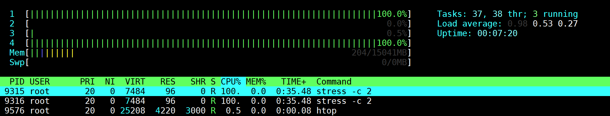
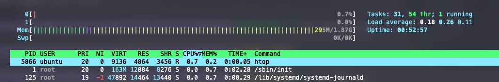
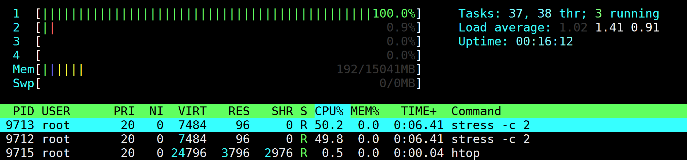
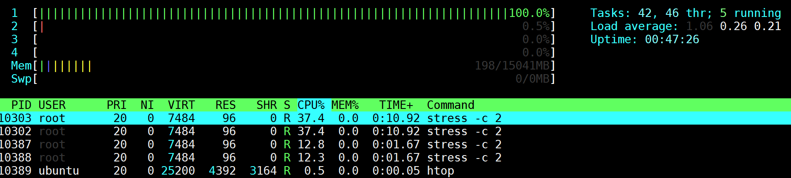

# Docker Resource Limits

## Overview

This lab demonstrates how to use Docker to apply resource limits to containers. You will learn how to restrict the resource consumption of containers and explore commands that utilize resource constraints effectively. By the end of this lab, you will understand how to ensure containers operate within defined resource limits.

### Lab Steps

#### Step 1: cgroups and the Docker CLI

Docker provides several flags through the `docker run` command to set cgroup limitations. Below are the most relevant flags for resource control:

```
docker run --help
...
--cpu-shares                    CPU shares (relative weight)
...
--cpuset-cpus                   CPUs in which to allow execution (0-3, 0,1)
...
--pids-limit                    Tune container pids limit (set -1 for unlimited)
```

For more details on these flags, see the Docker [reference guide](https://docs.docker.com/engine/reference/commandline/run/).

#### Step 2: Run a Container to Stress CPU

To simulate CPU stress on the Docker Host, start a container using the `stress` image. The container will be named `stresser` and will run two CPU-intensive tasks.

```
docker run -d --name stresser polinux/stress stress -c 2
```

This command will launch the container in the background. You can use tools like `htop` to observe the impact of this container on system resources.



Stop and remove the container once you’ve reviewed the impact:

```
docker stop stresser && docker rm stresser
```

Use `htop` to confirm the CPU has returned to normal.




#### Step 3: Set CPU Affinity

You can restrict a container to specific CPU cores using the `--cpuset-cpus` flag. For instance, to run the `stresser`container on only the first CPU core:

```
docker run -d --name stresser --cpuset-cpus 0 polinux/stress stress -c 2
```

Use `htop` to verify that the container processes are constrained to the specified CPU core.



Stop and remove the container:

```
docker stop stresser && docker rm stresser
```

Use `htop` to confirm the CPU has returned to normal.

#### Step 4: Set CPU Share Constraints

By default, Docker allocates an equal CPU share to all containers. You can modify this allocation using the `--cpu-shares`flag.

Start two containers with different CPU share values:

```
docker run -d --name container-1 --cpuset-cpus 0 --cpu-shares 768 polinux/stress stress -c 2
docker run -d --name container-2 --cpuset-cpus 0 --cpu-shares 256 polinux/stress stress -c 2
```

Verify the running containers:

```
docker ps
```

Use `htop` to observe how CPU time is distributed between the two containers.



Stop and remove both containers:

```
docker stop container-1 container-2 && docker rm container-1 container-2
```

#### Step 5: Preventing a Fork Bomb

A fork bomb can consume all system resources by endlessly replicating processes. Prevent this by using the `--pids-limit` flag.

Run a container with a PID limit of 200:

```
docker run --rm -it --pids-limit 200 debian:bookworm bash
```

Inside the container, attempt to create a fork bomb:

```
:(){ :|: & };:
```

Observe how the process limit prevents the container from consuming all resources. Exit the container with `Ctrl-C`.

### Summary

You have successfully learned how to use Docker's cgroups functionality to limit and manage container resource usage. By applying constraints on CPU usage and process limits, you can ensure containers operate within defined resource boundaries, improving the stability and performance of your Docker Host.


# Docker Memory Limits

## Overview

This lab demonstrates how to use Docker to apply memory limits to containers. You will learn how to monitor memory consumption by a container, set memory limits, and understand the importance of memory constraints to prevent Out-Of-Memory (OOM) errors and ensure the stability of other applications on the same host.

### Lab Steps

#### Step 1: Monitor Memory Consumption

Containers consume memory as they run, and monitoring memory usage is critical. Start a container that consumes memory using the `stress` image:

```
docker run -d --name memory-hog polinux/stress stress --vm 1 --vm-bytes 256M --vm-hang 0
```

This command launches a container in the background that will allocate and consume 256 MB of memory. Use the `docker stats` command to monitor the memory usage of the running container. 

Observe the memory usage displayed for the memory-hog container. This information helps in understanding the memory footprint of a container.

Additionally, open `htop` to observe the memory usage on the system:

```
docker stats memory-hog
```


Stop and remove the container once you have reviewed its behavior:

```
docker stop memory-hog && docker rm memory-hog
```

#### Step 2: Set Memory Limits

Docker allows you to set memory limits to prevent containers from consuming excessive memory and causing resource contention. Start a container with a memory limit of 128 MB:

```
docker run -d --name memory-limited --memory 128m polinux/stress stress --vm 1 --vm-bytes 256M --vm-hang 0
```

Since the `memory-limited` container attempts to allocate 256 MB, which exceeds the defined 128 MB limit, the container will eventually fail with an error. Verify the status of the container:

```
docker ps -a
```

You can also inspect the container logs to see the error message:

```
docker logs memory-limited
```

Stop and remove the container:

```
docker rm memory-limited
```

#### Step 3: Understand the Importance of Memory Limits

Without memory limits, a single container can consume all the available memory on the host, leading to performance degradation for other applications and even crashing the host. By setting memory constraints, you ensure resource isolation and prevent the "noisy neighbor" problem in shared environments.

Run a container without memory limits to observe the potential risks:

```
docker run -d --name no-limit polinux/stress stress --vm 1 --vm-bytes 1G --vm-hang 0
```

Use `docker stats` to observe how the `no-limit` container consumes memory:

```
docker stats no-limit
```

Stop and remove the container to free up host resources:

```
docker stop no-limit && docker rm no-limit
```

#### Step 4: Combine Memory and Swap Limits

You can also limit a container's use of swap memory along with physical memory. For example, set a memory limit of 128 MB and a swap limit of 256 MB:

```
docker run -d --name memory-swap-limited --memory 128m --memory-swap 256m polinux/stress stress --vm 1 --vm-bytes 192M --vm-hang 0
```

Since swap is not enabled on the host OS, the container cannot use swap memory and will be killed when it exceeds the 128 MB physical memory limit. Verify the container was killed by checking its status and logs:

```
docker ps -a | grep memory-swap-limited
```

```
docker logs memory-swap-limited
```

You should see that the container exited and the logs show the stress worker received signal 9 (OOM kill).

Remove the container:

```
docker rm memory-swap-limited
```

### Summary

In this lab, you have learned how to monitor and manage memory usage for Docker containers using memory limits and swap configurations. Proper memory management ensures containerized applications do not degrade host performance or affect other applications, maintaining stability in shared environments.